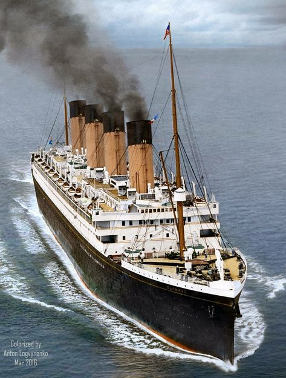

```{r setup, include=FALSE}
knitr::opts_chunk$set(echo = TRUE)

library(tidyverse)
library(readr)
library(tidymodels)
library(corrplot)
library(discrim)
library(poissonreg)
library(corrr)
library(dplyr)
library(ggplot2)
library(ggcorrplot)
library(vcd)
library(recipes)
library(randomForest)
library(tibble)
library(pROC)
library(caret)
```

{width="216"}

# Introduction

The aim of this project is to build a machine learning model that can
predict whether or not a passenger aboard the titanic will survive
depending on personal attributes. We will be using data from Github, and
implementing multiple techniques to yield the most accurate model for
this binary classification problem. Let’s go for it!

### About the Titanic

The Titanic, officially named the RMS Titanic, was a British passenger
liner that tragically sank on April 15, 1912, during its maiden voyage
from Southampton, England, to New York City. Built by the White Star
Line, it was the largest and most luxurious ship of its time, famously
deemed "unsinkable" due to its advanced engineering and safety features.
However, the Titanic struck an iceberg in the North Atlantic, leading to
the loss of over 1,500 lives out of the approximately 2,224 passengers
and crew on board.

Our data composes of passengers that boarded the titanic, each with
attributes such as passenger name, age, sex, class, fare, etc. We also
know which passengers survived the disaster, which we will use to build
a survival prediction model!

### The Data

Our data is not a historical record, it is derived from detailed records
of passengers, crew, and events surrounding the sinking of the Titanic.

The main sources include:

-   **Passenger and Crew Manifests**: These were official documents
    listing the passengers and crew on board, including ticket classes,
    ages, and names.

-   **Survivor Records**: Data on who survived was compiled from rescue
    records by the RMS Carpathia and inquiries conducted by the British
    and U.S. governments.

-   **Insurance and Compensation Claims**: Additional data on
    passengers’ ages, professions, and families was retrieved from legal
    documents filed after the disaster.

Sources like Github and Kaggle have refined and organized datasets or
public modeling analysis, we will be using Github's:
<https://github.com/datasciencedojo/datasets/blob/master/titanic.csv>

{width="194"}

### Project Roadmap

Now that we know the background and importance of our model, let’s
discuss how we are going to build it throughout this project. To build
our model effectively, we’ll start with initial data cleaning and
manipulation. Following this, we’ll conduct exploratory data analysis
(EDA) to gain deeper insights into our variables and objectives. Our
primary goal is to predict the binary class `survivors`, which will
serve as our response variable, using other predictor variables.

The workflow will include splitting the data into training and testing
sets, creating a recipe, and preparing for 10-fold cross-validation.
We’ll test four models on the training data: **Logistic Regression,
Lasso, Random Forest, and K-Nearest Neighbor.** Once the models are
evaluated, we’ll select the best-performing one to fit to the test data
and assess its overall effectiveness. Let's get started!

# Exploratory Data Analysis

Let's load in the data and take a peak.

```{r message=FALSE, warning=FALSE}
tidymodels_prefer()

titanic <- read_csv(file = "data/titanic.csv")

head(titanic)
```

Our data is successfully loaded and displaying the 12 columns or
variables in this data set. We can see NA values for cabin as well as
age. `Survived` is our response variable and is recorded as yes or no.
`Pclass` is recorded by `1st`, `2nd` or `3rd`.

### Cleaning Missing Values

Taking a closer look at missing values.

```{r}
titanic %>%
  summarise(across(everything(), ~ sum(is.na(.)), .names = "missing_{col}")) %>%
  pivot_longer(everything(), names_to = "Column", values_to = "Missing Values") %>%
  arrange(desc(`Missing Values`)) %>%
  filter(`Missing Values` > 0)
```

Variables `Cabin` and `Age` have the most missing values. Note that we
will fix missing values in Age first since it will likely be an
important predictor.

```{r}
dim(titanic)
```

Our dataset consists of 891 observations and 12 variables, which we will
use to build predictive models. Due to the small size of the dataset,
removing entire rows or columns with missing values is not the best
option, as it could compromise data integrity. Instead, we will handle
missing values by replacing them with a reasonable substitute based on
the data distribution (statistics). Specifically, we will use the
median!

```{r}
median_age <- median(titanic$age, na.rm = TRUE)
titanic <- titanic %>%
  mutate(age = ifelse(is.na(age), median_age, age))

summary(titanic$age)
anyNA(titanic$age) #check our work
```

Our median value is 28, which we have used to fill the gaps. We could
use the mean here as well for some model adjustments.

The variable Cabin has many missing values as well. Let's fix these with
a similar method.

```{r}
mode_cabin <- names(which.max(table(titanic$cabin, useNA = "no")))

titanic <- titanic %>%
  mutate(
    cabin = coalesce(cabin, mode_cabin)
  )
#table(titanic$cabin)
anyNA(titanic$cabin) #check our work
```

We have filled the gaps with the mode of Cabin's values. Lastly let's
clean any N/A in embarked.

```{r}
titanic <- titanic %>%
  filter(!is.na(embarked))
anyNA(titanic$embarked) #check our work
```

Now we can check:

```{r}
titanic %>%
  summarise(across(everything(), ~ sum(is.na(.)), .names = "missing_{col}")) %>%
  pivot_longer(everything(), names_to = "Column", values_to = "Missing Values") %>%
  arrange(desc(`Missing Values`)) %>%
  filter(`Missing Values` > 0)
```

Our data no longer has missing values!

### Data Manipulation

Moving onto data manipulation, since we have categorical and numeric
variables, we will need to factor categorical variables respectively.
Factor conversion treats the variable as categorical data instead of
numerical which is vital when dealing with various data. We will factor
our `survived` and `pclass` predictors.

```{r}
titanic <- titanic %>% 
  mutate(survived = factor(survived, 
                           levels = c("Yes", "No")),
         pclass = factor(pclass))

head(titanic)
```

We double-check our factorization with the head() function showing the
types of each variable. The `survived` column is correctly constructed
with `<fct>`. Setting these levels explicitly can help avoid confusion
and ensure correct model training behavior. We apply the same logic to
`Pclass`, (passenger class) since it takes values between 1-3.

We've cleaned up missing values, and grouped `survival` and `pclass`
respectively. Let's look at our prepared data, and provide a general
codebook.

```{r}
#head(titanic)
summary(titanic)
```

### Codebook

#### Variable Name: Description

-   `Passenger_id`: Random number for each passenger (1-891)

-   `Survived`: Survived (1) or died (0)

-   `Pclass`: Passenger's class (1 = 1st, 2 = 2nd, 3 = 3rd)

-   `Name`: Passenger's name (First, Title Last)

-   `Sex`: Passenger's sex (Male/Female)

-   `Age`: Passenger's age in years

-   `Sib_Sp`: Number of siblings/spouses aboard

-   `Parch`: Number of parents/children aboard

-   `Ticket`: Ticket number

-   `Fare`: Fare in dollars

-   `Cabin`: Cabin (A/B/C \#)

-   `Embarked`: Port of embarkation (S = Southampton, C = Cherbourg, Q =
    Queenstown)

{width="311"}

## Visual EDA

### No Survivors?

First we will visualize the target outcome response univariably (alone)
to peak at our results.

```{r}
# Bar plot of the 'survived' variable
ggplot(titanic, aes(x = survived)) +
  geom_bar(fill = c("#4CAF50", "#F44336"), alpha = 0.8) +
  labs(
    title = "Distribution of Survival Outcome",
    x = "Survival Status",
    y = "Count"
  ) +
  theme_minimal() +
  theme(
    plot.title = element_text(hjust = 0.5, size = 14, face = "bold"),
    axis.text = element_text(size = 12),
    axis.title = element_text(size = 13)
  )
```

The count shows about half of passengers managed to survive the
disaster. Let's take a look at our predictive variable relationships
with respect to survival, our response variable.

### Survival by Gender

```{r}
# Bar plot of survival by sex
ggplot(titanic, aes(x = sex, fill = survived)) +
  geom_bar(position = "fill", alpha = 0.8) + 
  scale_y_continuous(labels = scales::percent) +
  scale_fill_manual(values = c("#4CAF50", "#F44336"), 
                    labels = c("Survived", "Did Not Survive")) +
  labs(
    title = "Survival Rates by Sex",
    x = "Sex",
    y = "Proportion",
    fill = "Survival Status"
  ) +
  theme_minimal() +
  theme(
    plot.title = element_text(hjust = 0.5, size = 14, face = "bold"),
    axis.text = element_text(size = 12),
    axis.title = element_text(size = 13),
    plot.margin = margin(t = 10, r = 10, b = 10, l = 10)
  )

```

The proportion of survivors shows vastly more females survived than
males. The higher proportion of females compared to males aligns with
historical principles of "women and children first," which was applied
during the Titanic disaster's evacuation.

### Survival by Age

```{r}
ggplot(titanic, aes(x = age, fill = survived)) +
  geom_density(alpha = 0.5) +
  labs(
    title = "Age Distribution by Survival Status",
    x = "Age",
    y = "Density",
    fill = "Survival Status"
  ) +
  theme_minimal()
```

Our distributions follow a normal bell shape with peaks in both
distributions maximizing at about 20-40 years. Most passengers fall in
this range, representing adults. On the left, and notably survived, a
spike in number of younger passengers (children). This follows our
previous conclusion that women and children primarily survived. Our
distributions are skewed to the right, representing a few passengers
aged 50+. Most passengers that didn't survive were young adults and
primarily male.

### Survival by Class

```{r}
mosaic(~ survived + sex + pclass, data = titanic, shade = TRUE)

```

Each box shows the proportion of survivors and non-survivors in each
class. The shading helps you see which associations are statistically
significant by Pearson's Correlation Coefficient.

Firstly let's look at the colors: pink indicates a negative relationship
between gender and survival, and blue is positively correlated (gray is
uncorrelated). Again we observe positive survival correlations (blue)
for females and negative (pink) for males.

Under the non-survived grouping, we can see the disproportionate amount
of 3rd class male passengers triples the amount of 1st and 2nd class
non-survivors. The same applies for females in the 3rd class, and the
proportion of non-surviving 1st and 2nd class females is a sliver in
comparison. This shows the wealth disparity for passengers in poorer
cabins of the Titanic. Evacuation for 3rd class proved impossible due to
a combination of physical separation, and lack of access to lifeboats.

{width="261"}
{width="207"}

# Model Set Up

### Splitting the Data

Before building any models, we need to split our data into training and
testing sets. We will use a 70/30 split to ensure the testing set
contains a significant number of observations while providing the model
with a larger portion of data for training and learning. This approach
helps mitigate overfitting, as the testing set acts as an "answer key"
to evaluate the model's performance on unseen data.

To ensure consistency, we will set a random seed so that the
training/testing split remains the same each time we revisit the code.
Additionally, we will stratify the split based on the response variable,
`survived`, to preserve the proportion of survivors and non-survivors in
both the training and testing sets.

```{r}
#ensure recipe gets correct data 
titanic <- titanic %>% 
  mutate(
    survived = factor(survived, levels = c("Yes", "No")),
    pclass = factor(pclass)
  )

set.seed(3435)  
titanic_split <- titanic %>% 
  initial_split(strata = survived, prop = 0.7)
titanic_train <- training(titanic_split)
titanic_test <- testing(titanic_split)
dim(titanic_train)
dim(titanic_test)

nrow(titanic_train)/nrow(titanic)
nrow(titanic_test)/nrow(titanic)
```

We have split and stratified the data, with `623` training observations
and `268` testing observations. The split was successfully \~70% and
30%.

### Recipe Building

Because we are going to use the same predictors, model conditions, and
response variable, we create one central recipe for all the models we
will build. By using a recipe, you are ensuring that your data
pre-processing is robust, consistent, and easily reusable across
multiple models. This will make it easy to compare fitted models and
choose the best one.

```{r}
titanic_recipe <- recipe(survived ~ pclass + sex + age + 
                           sib_sp + parch + fare, titanic_train) %>% 
  step_impute_median(age) %>%
  step_dummy(all_nominal(), -survived) %>%
  step_zv(all_predictors())  # Removing zero variance predictors

```

### K-Fold Cross Validation

We will use stratified cross-validation to address the issue of
imbalanced data, stratifying by our response variable, `survived`.
Cross-validation helps ensure that our evaluation metrics are robust and
reliable. Instead of relying on a single train/test split,
cross-validation divides the training data into multiple folds. The
model is trained multiple times, with each fold serving as the testing
set once, while the remaining folds are used for training.

This approach provides a more accurate estimate of model performance and
generalization. Using k-fold cross-validation instead of testing models
on the entire training set ensures a better assessment of testing
accuracy. By averaging accuracy across several samples rather than
relying on a single sample, we reduce variation as the number of folds
increases, leading to more stable and trustworthy results.

```{r}
# 10-fold cross-validation
cv_splits <- vfold_cv(titanic_train, v = 10, strata = "survived")

# Check the distribution of the outcome variable in each fold
cv_splits$splits[[1]] %>%
  analysis() %>%
  count(survived)

```

## Model Building

**How do we fit on a model?**

<div>

1.  Set up the model by specifying what type of model, setting its
    engine, and setting its mode (which was always classification).

2.  Set up the workflow, add the new model, and add the established
    recipe.

Skip steps 3-5 for Logistic Regression (few hyper parameters to tune)

3.  Set up the tuning grid with the parameters that we want tuned, and
    how many different levels of tuning.
4.  Tune the model and specify the workflow, k-fold cross validation
    folds, and the tuning grid for our chosen parameters to tune.
5.  Select the most accurate model from all of the tuning, finalize the
    workflow with those tuning parameters.
6.  Fit that model with our workflow to the training data set.

</div>

Now that we have the steps, let's fit our prepared training sets on 4
different models. Picking our models depends on classification vs.
regression as well as linearity and normality. Let's take a look:

**1. Logistic Regression:**

It’s a good baseline model for classification tasks. It’s interpretable
and provides clear insights into the relationships between predictors
and the outcome. Works well if the relationships between features and
the target are linear.

**2. Random Forest**

It’s a powerful, non-linear model that handles both numerical and
categorical features well. Automatically captures interactions and
non-linear relationships. Robust to overfitting and provides feature
importance scores. A potential drawback is computation time, which works
in our favor.

**3. Lasso (Logistic Regression with L1 Penalty)**

Performs feature selection by shrinking some coefficients to zero.
Useful for datasets with many predictors or collinearity issues. **When
to skip**: If your dataset has relatively few features (as in Titanic)
or no strong collinearity.

**4. K-Nearest Neighbor (k-NN)**

Intuitive and effective for small to medium-sized datasets. Makes no
assumptions about the data distribution. A potential drawback is
computation expense, which works in our favor.

**After our models are fit, how will we pick the best model?**

#### Performance Metric: ROC

I decided to set my metric of performance as **roc_auc**, because that
is what shows the most significant level of efficiency in a binary
classification model where the data is not perfectly balanced. This
essentially calculates the area under the curve for the receiver
operating characteristic (ROC) curve, which highlights the trade-off
between sensibility and sensitivity.

```{r}
roc_auc_table <- data.frame(
  `ROC AUC Range` = c("0.5", "0.6–0.7", "0.7–0.8", "0.8–0.9", "0.9–1.0"),
  Performance = c("No discrimination", "Poor discrimination", "Acceptable discrimination", "Excellent discrimination", "Outstanding discrimination"))
roc_auc_table
```

### 1. Logistical Regression Model

Logistic regression starts with a linear model. Just like linear
regression, we use a linear equation to predict a continuous outcome.
However, the prediction from this model is not constrained between 0 and
1, which is necessary for a probability. This is where the logistic
(sigmoid) function comes in. This transforms the output of the linear
equation into a probability between 0 and 1. Then the model coefficients
are learned by maximizing the likelihood of the data (MLE).

Let's interpret the math and model building steps into code: After
setting up the engine and recipe in a workflow, we will train on our
training data. Predictions are made on the test data, including class
probabilities, and these are used to calculate the ROC AUC, a metric for
evaluating classification performance. An ROC curve is plotted to
visualize the trade-off between sensitivity and specificity, helping to
assess the model's ability to distinguish between classes. We will
repeat this process for all the models, slightly tweaked.

Let's put it to work!

```{r}
log_reg_model <- logistic_reg(mode = "classification") %>%
  set_engine("glm")

log_reg_workflow <- workflow() %>%
  add_model(log_reg_model) %>%
  add_recipe(titanic_recipe)

log_reg_fit <- fit(log_reg_workflow, data = titanic_train)

log_reg_preds <- predict(log_reg_fit, titanic_test, type = "prob") %>%
  bind_cols(predict(log_reg_fit, titanic_test)) %>%
  bind_cols(titanic_test)

# Compute ROC AUC Metric
roc_auc_log <- roc_auc(log_reg_preds, truth = survived, .pred_Yes)
roc_auc_log

# ROC Curve Plot
roc_curve_data <- roc_curve(log_reg_preds, truth = survived, .pred_Yes)

ggplot(roc_curve_data, aes(x = 1 - specificity, y = sensitivity)) +
  geom_line(color = "blue", linewidth = 1.2) +
  geom_abline(linetype = "dashed", color = "gray") +
  labs(
    title = "ROC Curve for Logistic Regression",
    x = "1 - Specificity (False Positive Rate)",
    y = "Sensitivity (True Positive Rate)"
  ) +
  theme_minimal()

```

Our Logistical Regression model ROC value is excellent discrimination,
in other words our model can reliably distinguish between survivors and
non-survivors!

For a simple data set with clear separability (Titanic has strong
survival predictors like sex and class), an AUC \> 0.85 is expected.

### 2. Random Forest Model

A random forest model is a supervised ensemble learning technique that
consists of numerous decision trees. Decision tree models tend to
struggle with over-fitting the training data, which is overcome in a
random forest by averaging the prediction results of each decision tree
and determining a final output. The random forest algorithm stacks
multiple classifiers together to improve its overall performance!

```{r}

rf_model <- rand_forest(mode = "classification", mtry = 3, trees = 500) %>%
  set_engine("randomForest")

# Set up the workflow with the recipe and model
rf_workflow <- workflow() %>%
  add_model(rf_model) %>%
  add_recipe(titanic_recipe)

# Fit the model to the training data
rf_fit <- fit(rf_workflow, data = titanic_train)

# Make predictions on the test data
rf_preds <- predict(rf_fit, titanic_test, type = "prob") %>%
  bind_cols(predict(rf_fit, titanic_test)) %>%
  bind_cols(titanic_test)

# Compute ROC AUC Metric
roc_auc_rf <- roc_auc(rf_preds, truth = survived, .pred_Yes)
roc_auc_rf

# ROC Curve Plot
roc_curve_data <- roc_curve(rf_preds, truth = survived, .pred_Yes)

ggplot(roc_curve_data, aes(x = 1 - specificity, y = sensitivity)) +
  geom_line(color = "blue", linewidth = 1.2) +
  geom_abline(linetype = "dashed", color = "gray") +
  labs(
    title = "ROC Curve for Random Forest",
    x = "1 - Specificity (False Positive Rate)",
    y = "Sensitivity (True Positive Rate)"
  ) +
  theme_minimal()
```

While the model is performing really well with an AUC of 0.89, there's
always room for improvement! Let's try model tuning to potentially
enhance performance further. Random Forests in particular can often
benefit from tuning hyper-parameters like: `min_n`, `mtry`, and `trees`

**Tuning Random Forest Model Parameters:**

-   `mtry` which represents the amount of predictors that will be
    sampled randomly during the creation of the models.
-   `trees` which represents the amount of trees present in the random
    forest model.
-   `min_n` which represents the minimum amount of data values required
    to be in a tree node in order for it to be split further down the
    tree.

```{r, warnings = F, message=F}

# Define the random forest model with tunable parameters
rf_model <- rand_forest(
  mode = "classification", 
  mtry = tune(),    # mtry is a tuning parameter
  trees = tune(),   # trees is a tuning parameter
  min_n = tune()    # min_n is a tuning parameter
) %>%
  set_engine("randomForest") %>%
  set_mode("classification")

# workflow with variable tuning
rf_forest_workflow <- workflow() %>%
  add_model(rf_model) %>%
  add_recipe(titanic_recipe)

rf_grid <- grid_regular(
  mtry(range = c(2, 5)),   # Fewer values for mtry
  trees(range = c(100, 500)), # Fewer trees
  min_n(range = c(2, 5)),  # Fewer values for min_n
  levels = 3                # Reduce levels
)

# Run the tuning with cross-validation
rf_tune <- tune_grid(
  rf_forest_workflow,
  resamples = cv_splits,  # Using cross-validation splits
  grid = rf_grid
)

# View the best tuning results
rf_tune_results <- rf_tune %>%
  collect_metrics()

# Check for the best parameters and AUC
rf_tune_results %>%
  filter(.metric == "roc_auc") %>%
  arrange(desc(mean))

best_rf_result <- rf_tune_results %>%
  filter(.metric == "roc_auc") %>%  # Filter only for ROC AUC metric
  slice_max(mean, n = 1)           # Select the row with the highest mean value

print(best_rf_result)

```

Best Performance: The top configuration is `trees = 100` and
`min_n = 2`, yielding a mean ROC AUC of 0.8661952. As the `trees`
increase to 500, the performance doesn’t drastically improve compared to
300. Based on this table, the configuration with `trees = 100` and
`min_n = 2` seems to strike the best balance between performance and
complexity.

**However, the model has better ROC AUC value 0.89 before tuning
parameters, so we will keep the original Random Forest model.**

### 3. Lasso (Logistic Regression with L1 Penalty) Model

Lasso regression, short for **Least Absolute Shrinkage and Selection
Operator**, is a type of regression analysis used for both prediction
and feature selection. It’s especially useful when you have many
features and suspect that some are irrelevant or redundant. Lasso works
by adding a penalty term to the ordinary least squares (OLS) loss
function that encourages simpler models with fewer predictors. Since our
data is relatively small this model may not fit better than others.
Let's try it out!

```{r}
lasso_model <- logistic_reg(
  mode = "classification",
  penalty = tune(),  # Tuning parameter
  mixture = 1        # Full Lasso (mixture = 1 corresponds to Lasso)
) %>%
  set_engine("glmnet")

# Set up the workflow with the recipe and model
lasso_workflow <- workflow() %>%
  add_model(lasso_model) %>%
  add_recipe(titanic_recipe)

# Define a grid for the penalty parameter
lasso_grid <- grid_regular(
  penalty(range = c(-5, 0)),  # Log-scale range for the penalty (lambda)
  levels = 50                # Number of levels in the grid
)

# Tune the Lasso model
lasso_tune <- tune_grid(
  lasso_workflow,
  resamples = cv_splits,  # Use cross-validation splits
  grid = lasso_grid,
  metrics = metric_set(roc_auc)  # Use ROC AUC as the evaluation metric
)

lasso_results <- lasso_tune %>%
  collect_metrics()

lasso_results %>%
  filter(.metric == "roc_auc") %>%
  arrange(desc(mean))  # Sort by best ROC AUC

# find best penalty value
best_lasso <- lasso_tune %>% 
  select_best(metric = "roc_auc")
# Finalize the workflow with the best parameters
final_lasso_workflow <- finalize_workflow(lasso_workflow, best_lasso)

# Fit the final model to the training data
final_lasso_fit <- fit(final_lasso_workflow, data = titanic_train)

# Make predictions on the test data
lasso_preds <- predict(final_lasso_fit, titanic_test, type = "prob") %>%
  bind_cols(predict(final_lasso_fit, titanic_test)) %>%
  bind_cols(titanic_test)

# Compute the ROC AUC
roc_auc_lasso <- roc_auc(lasso_preds, truth = survived, .pred_Yes)
roc_auc_lasso

# Plot the ROC Curve
roc_curve_data <- roc_curve(lasso_preds, truth = survived, .pred_Yes)

ggplot(roc_curve_data, aes(x = 1 - specificity, y = sensitivity)) +
  geom_line(color = "blue", linewidth = 1.2) +
  geom_abline(linetype = "dashed", color = "gray") +
  labs(
    title = "ROC Curve for Lasso Regression",
    x = "1 - Specificity (False Positive Rate)",
    y = "Sensitivity (True Positive Rate)"
  ) +
  theme_minimal()

```

Our model did okay with an ROC AUC of 0.875: A value closer to 1 is
excellent, and values above 0.85 typically represent a strong model,
especially for imbalanced datasets. This is not our best performing
metric as of yet, even with parameter tuning. Let's move on to K-NN
modeling.

### 4. K-Nearest Neighbor (k-NN) Model

The k-Nearest Neighbors algorithm is a non-parametric, instance-based
learning method used for classification and regression tasks. It
predicts outcomes based on the similarity of data points in the feature
space. k-NN identifies the `k` closest data points (neighbors) to a
target observation in the training data set (for future prediction).
Think of grouping classifiers with clusters of similar types based on
distance measurements, such as the *Euclidean distance*. We can use
K-Nearest Neighbor for smaller data sets where computational cost is
manageable as well.

```{r}

knn_model <- nearest_neighbor(
  neighbors = tune(), # Tuning parameter: number of neighbors (k)
  weight_func = "rectangular", 
  dist_power = 2 # Euclidean distance
) %>%
  set_engine("kknn") %>%
  set_mode("classification")

knn_grid <- grid_regular(
  neighbors(range = c(1, 30)), # Range of k values to tune
  levels = 10 # Number of grid levels
)

knn_workflow <- workflow() %>%
  add_model(knn_model) %>%
  add_recipe(titanic_recipe) # Use the existing recipe
```

```{r}

knn_tune <- tune_grid(
  knn_workflow,
  resamples = cv_splits, # previous 10-fold cross-validation
  grid = knn_grid
)

# best tuning results
knn_tune_results <- knn_tune %>%
  collect_metrics()

# Select the best k based on ROC AUC
best_knn <- select_best(knn_tune, metric = "roc_auc")
print(best_knn)

# Finalize the workflow with the best k value
final_knn <- finalize_workflow(knn_workflow, best_knn)

# Fit the final model to the training data
knn_fit <- fit(final_knn, data = titanic_train)
```

```{r}
# Make predictions on the test set
knn_preds <- predict(knn_fit, titanic_test, type = "prob") %>%
  bind_cols(predict(knn_fit, titanic_test)) %>%
  bind_cols(titanic_test)

# Compute ROC AUC
roc_auc_knn <- roc_auc(knn_preds, truth = survived, .pred_Yes)
print(roc_auc_knn)

# ROC Curve
roc_curve_data <- roc_curve(knn_preds, truth = survived, .pred_Yes)

ggplot(roc_curve_data, aes(x = 1 - specificity, y = sensitivity)) +
  geom_line(color = "blue", linewidth = 1.2) +
  geom_abline(linetype = "dashed", color = "gray") +
  labs(
    title = "ROC Curve for k-NN",
    x = "1 - Specificity (False Positive Rate)",
    y = "Sensitivity (True Positive Rate)"
  ) +
  theme_minimal()

```

Our value of 0.867 is a good range, but let's try to improve it!

**Tuning Neighbors**

Our parameter `neighbors` is the most important tuning parameter for
k-NN. It defines the number of nearest neighbors to be considered when
making a prediction for a new data point.

Effect:

-   If k is small (e.g., 1 or 3), the model may be sensitive to noise,
    leading to overfitting.

-   If k is large, the model may become too general and underfit.

-   A good k helps balance the trade-off between underfitting and
    overfitting.

We will now find our best K value with a tuning grid:

```{r}
# Create a refined grid for tuning k
knn_grid_refined <- grid_regular(
  neighbors(range = c(3, 15)), # Focused range around promising values
  levels = 13 # Test k = 3 through k = 15 with step = 1
)

# Run the refined tuning with cross-validation
knn_tune_refined <- tune_grid(
  knn_workflow,
  resamples = cv_splits, # Existing 10-fold cross-validation splits
  grid = knn_grid_refined
)

# Collect refined tuning results
knn_tune_refined_results <- knn_tune_refined %>%
  collect_metrics()

# Select the best k based on ROC AUC
best_knn_refined <- select_best(knn_tune_refined, metric = "roc_auc")

# Print the best parameters
print(best_knn_refined)

# Plot the ROC AUC results for visualization
knn_tune_refined_results %>%
  filter(.metric == "roc_auc") %>%
  ggplot(aes(x = neighbors, y = mean)) +
  geom_line(color = "blue", linewidth = 1) +
  geom_point(color = "red") +
  labs(
    title = "ROC AUC for Refined k-NN Tuning",
    x = "Number of Neighbors (k)",
    y = "Mean ROC AUC"
  ) +
  theme_minimal()

```

Our best tuning parameter for `neighbor` is **11**! Let's run our model
again with this new information.

```{r}
# Use the best k from the refined tuning process: 11!
best_knn_refined_k <- best_knn_refined$neighbors

# Update the k-NN model with the best k value 
knn_final_model <- nearest_neighbor(
  neighbors = best_knn_refined_k,
  weight_func = "rectangular",
  dist_power = 2
) %>%
  set_engine("kknn") %>%
  set_mode("classification")

# Finalize the workflow with the chosen model and recipe
final_knn_workflow <- workflow() %>%
  add_model(knn_final_model) %>%
  add_recipe(titanic_recipe)

# Fit the final model to the full training data
final_knn_fit <- fit(final_knn_workflow, data = titanic_train)

# Make predictions on the test data
final_knn_preds <- predict(final_knn_fit, titanic_test, type = "prob") %>%
  bind_cols(predict(final_knn_fit, titanic_test)) %>%
  bind_cols(titanic_test)

# Compute ROC AUC Metric
roc_auc_knn <- roc_auc(final_knn_preds, truth = survived, .pred_Yes)
print(roc_auc_knn)

# ROC Curve Plot
final_roc_curve_data <- roc_curve(final_knn_preds, truth = survived, .pred_Yes)

ggplot(final_roc_curve_data, aes(x = 1 - specificity, y = sensitivity)) +
  geom_line(color = "blue", linewidth = 1.2) +
  geom_abline(linetype = "dashed", color = "gray") +
  labs(
    title = "Final ROC Curve for k-NN Model",
    x = "1 - Specificity (False Positive Rate)",
    y = "Sensitivity (True Positive Rate)"
  ) +
  theme_minimal()

```

After tuning, our updated ROC curve reflects improved performance by a
smoother curve and greater area under the curve (AUC). The
hyperparameter adjustments resulted in a model better suited to the
data, offering stronger classification performance! An ROC AUC of 0.876:
Excellent discrimination.

We have 4 models with excellent ROC AUC values, let's compare these and
finalize the best predictive powered engine!

# Model Selection

It’s finally time to compare the results of all of our models and see
which ones performed the best! Let's make a tibble with the ROC AUC
values from each model.

```{r}
final_compare_tibble <- tibble(Model = c("Logistic Regression",
                                         "Random Forest",
                                         "Lasso Regression",
                                         "K Nearest Neighbors"),
                               ROC_AUC = c(roc_auc_log$.estimate,
                                           roc_auc_rf$.estimate,
                                           roc_auc_lasso$.estimate,
                                           roc_auc_knn$.estimate))

# Arranging by lowest RMSE
final_compare_tibble <- final_compare_tibble %>% 
  arrange(desc(ROC_AUC))

final_compare_tibble
```

Our Random Forest mean ROC AUC has proved most predictive on our
training data. In last we have Logistic Regression.

-   Logistic regression likely underperformed because it is too simple
    to capture the complex relationships in the Titanic dataset,
    especially when compared to Random Forest, which is more flexible
    and able to model non-linear interactions between features.

-   KNN worked well due to its ability to capture local patterns and
    non-linear relationships without making assumptions about the data.

-   Lasso was effective because of its ability to perform feature
    selection and avoid overfitting, especially if there were irrelevant
    or highly correlated features in the dataset.

Both models did well, but **Random Forest** outperformed them because of
its ensemble nature, ability to model non-linearities, and automatic
handling of feature interactions without requiring explicit tuning of
hyperparameters.

**Let's visualize the model performances.**

```{r}

# Histogram of ROC AUC values
ggplot(final_compare_tibble, aes(x = Model, y = ROC_AUC, fill = Model)) +
  geom_col() +
  labs(
    title = "Comparison of ROC AUC Across Models",
    x = "Model",
    y = "ROC AUC"
  ) +
  theme_minimal() +
  scale_fill_brewer(palette = "Set2") +
  theme(
    axis.text.x = element_text(angle = 45, hjust = 1)
  ) +
  coord_cartesian(ylim = c(0.8, 0.9))  # Adjust y-axis range to zoom in

```

-   The Random Forest model achieved the **highest average ROC AUC value
    (0.889)**, indicating it is the most effective at distinguishing
    between the classes (e.g., survived or not). This implies that the
    dataset benefits from a model that captures complex interactions
    between features, as Random Forest inherently does through its
    ensemble approach.

This is probably due to the dataset following an interesting
relationship whereas prominent behavioral patterns dictated the
randomness of our data. Since all the women and children on the Titanic
were first priority, the data is biased in predictors and survivors.

-   The k-NN model performed well with a **ROC AUC of 0.876**,
    suggesting that the relationships between data points (neighbors) in
    feature space provide meaningful insights. However, it is slightly
    less robust than Random Forest, likely because it lacks a mechanism
    for learning feature importance.

-   Both Lasso Regression and Logistic Regression have similar **ROC AUC
    values (0.876 and 0.875**, respectively). This indicates that linear
    models with regularization (Lasso) or standard generalized linear
    models (Logistic Regression) can capture important patterns but may
    be limited in capturing non-linear relationships in the dataset.

## Congratulations to Random Forest!

We will proceed with one of the random forest models since it
demonstrated the best performance. I’m curious to see which specific
random forest model outperformed the others! Since we’ve already
identified the top-performing model, there’s no need to finalize the
workflows or make further adjustments. The next step is to evaluate this
champion model by fitting it to the testing data and analyzing its true
performance.

```{r}
# Prepare the recipe and bake it on the test data
prepped_recipe <- prep(titanic_recipe, training = titanic_train)
processed_test <- bake(prepped_recipe, new_data = titanic_test)

# Extract the random forest model (fit)
rf_object <- extract_fit_engine(rf_fit)

# Make predictions using all trees in the random forest
individual_tree_preds <- predict(rf_object, processed_test, predict.all = TRUE)

# Initialize a vector to store AUC values for each tree
tree_roc_values <- numeric(ncol(individual_tree_preds$individual))

# Loop through each tree's predictions
for (i in 1:ncol(individual_tree_preds$individual)) {
  # Get predictions for the i-th tree and convert "Yes"/"No" to numeric (1/0)
  current_preds <- as.numeric(individual_tree_preds$individual[, i] == "Yes")
  
  # Calculate ROC AUC for the current tree's predictions, suppressing warnings and messages
  roc <- suppressMessages(suppressWarnings(roc(processed_test$survived, current_preds)))
  tree_roc_values[i] <- auc(roc)
}

# Print the results of AUC values for all trees
#tree_roc_values

# Identify the index of the best-performing tree
best_tree_index <- which.max(tree_roc_values)
best_auc <- tree_roc_values[best_tree_index]

# Create a tibble to store the results for the best tree
best_tree_result <- tibble(Tree = best_tree_index, ROC_AUC = best_auc)

# Print the result
print(best_tree_result)

```

### Congratulations Random Forest Tree #85!

Our most impressive tree of the Random Forest Model is #85, with an AUC
of `0.846` .

The AUC of our best-performing individual tree being lower than the
ensemble (0.846 vs. 0.89) simply indicates that this particular tree
doesn't capture all the complexities of the data as well as the combined
model does. However, the random forest as a whole benefits from the
predictions of all trees, including the one with lower AUC.

**Let's check on our testing data!**

```{r}

# Make predictions on the test set using the fitted model
rf_preds <- predict(rf_fit, titanic_test, type = "prob") %>%
  bind_cols(predict(rf_fit, titanic_test)) %>%
  bind_cols(titanic_test) # Adding the original test data to the predictions

# View the first few rows of the predictions
head(rf_preds)
# Plot the predicted probabilities for survival
ggplot(rf_preds, aes(x = .pred_Yes)) +
  geom_histogram(bins = 30, fill = "blue", alpha = 0.7) +
  labs(title = "Distribution of Predicted Probabilities for Survival",
       x = "Predicted Probability of Survival (Yes)",
       y = "Count") +
  theme_minimal()

```

The histogram we created shows the distribution of predicted
probabilities for survival. Given the skewed nature of the predicted
probabilities (more concentrated towards 0), it's likely that our model
struggles to predict the minority class (survival). A well-performing
model would have a wider distribution with more instances predicting
higher probabilities for survival (if survival was the minority class).

**Why does this happen?**

-   Effect on Predictions: The model likely learned the imbalance and is
    assigning low probabilities for survival (which corresponds to the
    majority class). This could explain why most of the predicted
    probabilities for survival are clustered near 0.

-   Model Complexity: Random forests are typically powerful models, but
    they can struggle if the features provided don't contain enough
    discriminative power, especially in an imbalanced classification
    scenario like this.

**Let's look at the statistics:**

```{r}
# Check the distribution of predicted probabilities for 'Yes'
summary(rf_preds$.pred_Yes)
# Check the distribution of the actual survival variable
table(rf_preds$survived)

```

### Predicted Probabilities for Survival (`.pred_Yes`):

-   **Min: 0.0000** — There are some predictions where the model is
    almost certain that the person did not survive (i.e., very low
    predicted probability for survival).

-   **1st Quartile: 0.0235** — A majority of the predicted probabilities
    for survival are low, meaning the model is predicting that most
    passengers did not survive. Example, men and 3rd class passengers.

-   **Mean: 0.3619** — On average, the model predicts a 36.2%
    probability of survival, which indicates that it might be predicting
    more "No" than "Yes" outcomes overall. This is good considering a
    majority didn't survive the sinking.

-   **3rd Quartile: 0.7585** — About 75% of the passengers who are
    predicted to survive have a probability greater than 75%. Follows
    the logic of "women and children first".

-   **Max: 1.0000** — There are a few passengers with extremely high
    predicted probabilities of survival, suggesting the model is
    confident in predicting that they survived. For example, wealthy
    upper class women and children almost certainly survived.

    ```{r}

    # Get the predicted class labels
    rf_preds_class <- predict(rf_fit, titanic_test) %>% 
      bind_cols(titanic_test) %>%
      dplyr::select(.pred_class)

    # Calculate Accuracy
    accuracy <- mean(rf_preds_class$.pred_class == titanic_test$survived)
    cat("Accuracy:", accuracy, "\n")

    # Calculate Error Rate
    error_rate <- 1 - accuracy
    cat("Error Rate:", error_rate, "\n")

    ```

    ```{r}
    # AUC
    roc_auc_rf <- roc_auc(rf_preds, truth = survived, .pred_Yes)
    cat("AUC:", roc_auc_rf$.estimate, "\n")

    ```

    -   **Good Accuracy**: Your model is correctly predicting a large
        percentage of cases.

    -   **Good AUC**: The model's ability to rank survivors higher than
        non-survivors is strong.

    -   **Reasonable Error Rate**: The error rate is fairly low, though
        there's still room for improvement, particularly with
        misclassifications between survivors and non-survivors.

    # Conclusion

The prioritization of women and children in the Titanic disaster offers
insights into the social dynamics and ethical decisions that influenced
the behavior of both the passengers and the crew. The data reflecting
this prioritization can offer a few key observations and potential
conclusions about data integrity and its implications:

### Data Integrity and Bias:

-   **Survival Disparities**: If the data reveals that women and
    children were more likely to survive than men, this could indicate a
    bias in the survival rates due to the prioritization of these
    groups. The integrity of the dataset is important for analysis
    accuracy, any partial bias skews the data. For modeling survival,
    it's important to understand that survival outcomes might not be
    purely random or based on an individual's characteristics alone
    (age, gender, class, etc.) but were significantly affected by
    societal norms.

### Understanding Missing or Imbalanced Data:

-   **Missing Data**: Some historical records were never recovered, such
    as age, class, and cabin. Since the data is relatively small, these
    possible outliers could dramatically change our analysis. For future
    work, we will want to use full and numerous observation filled data
    sets.

### Future Model Improvements:

1.  **Address Class Imbalance**:

    -   **Class Weights**: Adjust the `class_weight` parameter to assign
        higher weights to the minority class (survival). In random
        forests, this can help the model focus more on the minority
        class.

    -   **Resampling**: Use techniques like SMOTE (Synthetic Minority
        Over-sampling Technique) or down-sampling the majority class to
        make the class distribution more balanced in training.

2.  **Feature Engineering**:

    -   Add more features or interactions between existing features that
        might improve the model’s ability to distinguish between
        survival and non-survival.

    -   Consider adding features like `family_size` (sum of `sib_sp` and
        `parch`) or `fare_per_person` (ratio of `fare` to the number of
        passengers in the same class).

3.  **Model Tuning**:

    -   More experimentation with hyper parameter tuning (e.g., number
        of trees, maximum depth, minimum number of samples per leaf) to
        better capture the complexity of the dataset.

4.  **Alternative Models**:

    -   **Gradient Boosting** might be more suitable for this type of
        dataset, particularly if we balance the classes or use
        regularization.
    -   **QDA** could be a better choice if the variances differ across
        classes, though it still assumes normality.
    -   **Ensemble Methods**: Use ensemble methods like boosting, which
        may help improve predictive performance on imbalanced datasets.

{width="308"}

## Titanic 1997 film's Predictive Power?

Rose, a first-class passenger, is engaged to the wealthy but controlling
Cal Hockley, while Jack, a penniless artist, wins a ticket to board the
ship. They fall in love during the voyage, but their romance is cut
short by the Titanic’s tragic sinking. The film alternates between
present-day and flashbacks to the ill-fated journey, culminating in the
ship’s disastrous crash into an iceberg. Rose survives, but Jack dies in
the cold waters of the Atlantic. The movie explores drama, class divide,
and survival.

Upon watching the film we can see the excellent predictive power. The
variable relationships we have just analyzed are ever-present. Rose is a
first class female survivor, while Jack is a poor man doomed by societal
norms but most of all –love.

{width="163"}
